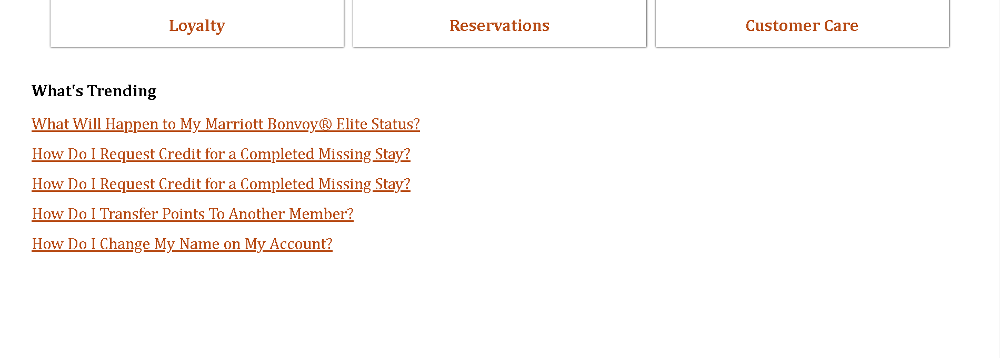

# Marriott Bonvoy Help Page

This repository contains the code for the **Marriott Bonvoy Customer Service and Online Help** webpage. The page is designed to provide users with an intuitive interface for accessing help topics, searching for information, and exploring trending queries. It also highlights featured topics and category filters for quick navigation.

---

## 🌟 Features

1. **Navigation Bar**: 
   - Includes links to key sections like Find & Reserve, Deals & Packages, Meetings & Events, Our Brands, Credit Cards, About Marriott Bonvoy, and Help Home.
   - Displays the Marriott Bonvoy logo.

2. **Hero Section**:
   - **Search Bar**: Allows users to search for topics or keywords.
   - **Featured Topics**: Displays clickable images for Membership, Promos & Offers, and Marriott News.
   - **Category Filters**: Includes filters for Loyalty, Reservations, and Customer Care.
   - **Trending Topics**: Lists frequently asked questions or trending queries.

3. **Footer**:
   - **Social Media Icons**: Links to Facebook, Instagram, Twitter, Messenger, and YouTube.
   - **Copyright and Terms**: Displays copyright information and links to Terms of Use, Program Terms & Conditions, Privacy Center, and an option for "Do Not Sell My Personal Information."

4. **Interactivity**:
   - Hover effects on featured topics for better user experience.

---

## 🛠️ Technologies Used

- **HTML5**: For the structure of the webpage.
- **CSS3**: For styling and layout.
- **JavaScript**: For hover effects and interactivity.
- **Font Awesome**: For social media and other icons.

---

## 📂 Project Structure

```
root/
├── index.html        # Main HTML file
├── style.css         # CSS file for styling
├── Images/           # Folder containing all image assets
└── README.md         # Project documentation
```

---

## 🖼️ Output View

### 1. Navigation Bar  


### 2. Hero Section  



### 3. Footer  


---

## 🚀 How to Run Locally

1. Clone this repository:
   ```bash
   git clone https://github.com/PriyaMaity/Jw-Marriot.git
   ```

2. Navigate to the project folder:
   ```bash
   cd help-page
   ```

3. Open the `index.html` file in your browser:
   - On most systems, double-clicking the file will launch it in the default web browser.

---

## ✨ Future Enhancements

- **Responsiveness**: Make the webpage fully responsive for all devices.

---

## 👩‍💻 Author

- **Priya Maity**  
  GitHub: [PriyaMaity](https://github.com/PriyaMaity)  
  LinkedIn: [Priya Maity](#)
